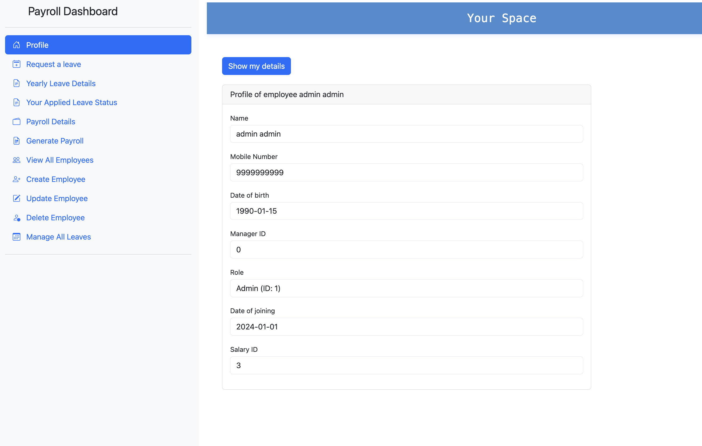
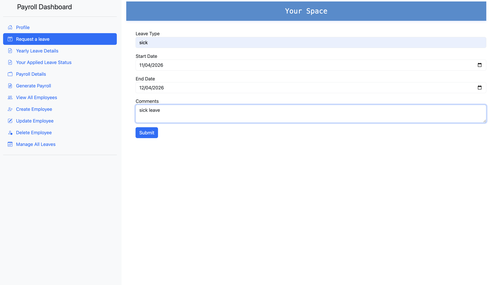
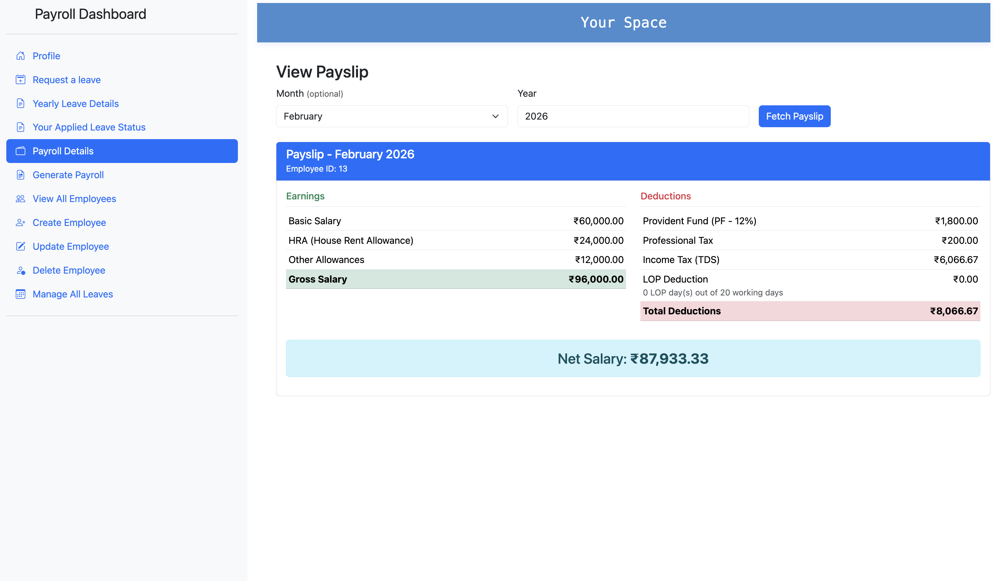
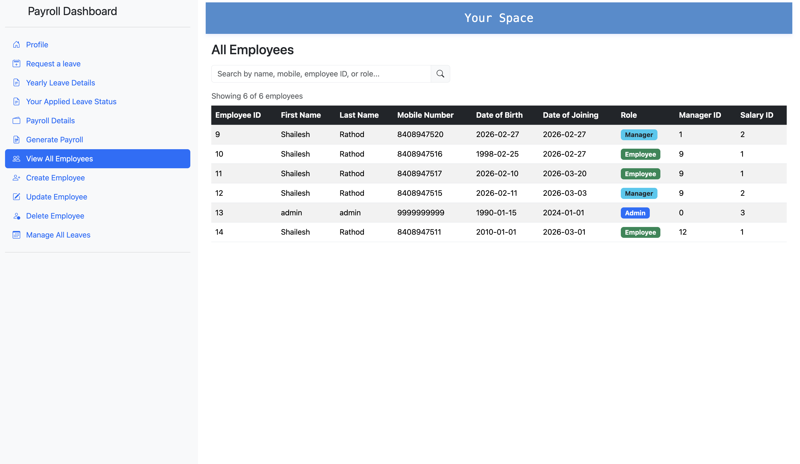
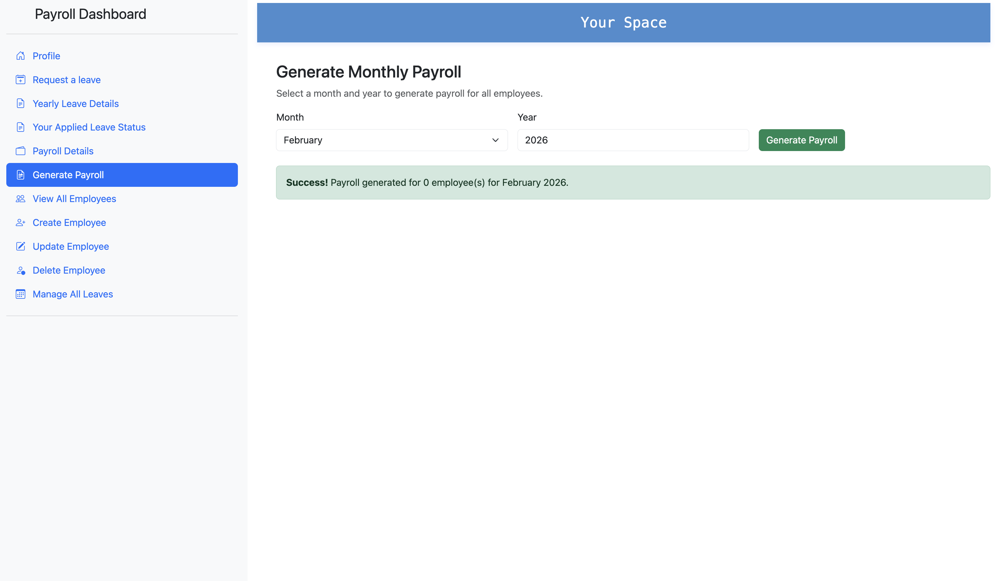
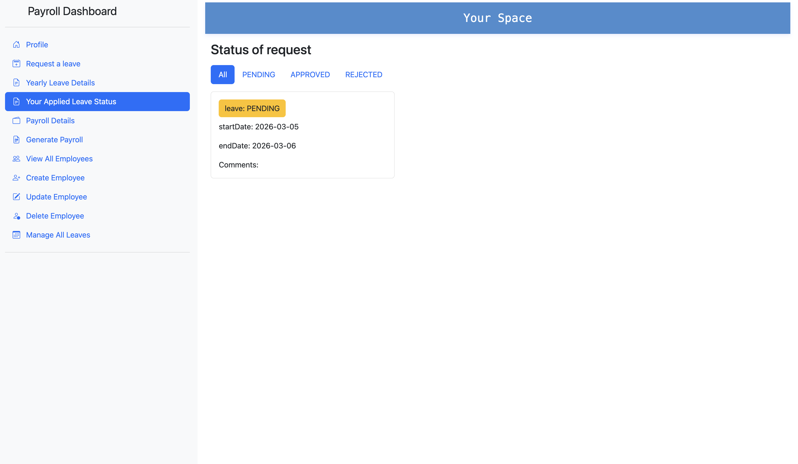
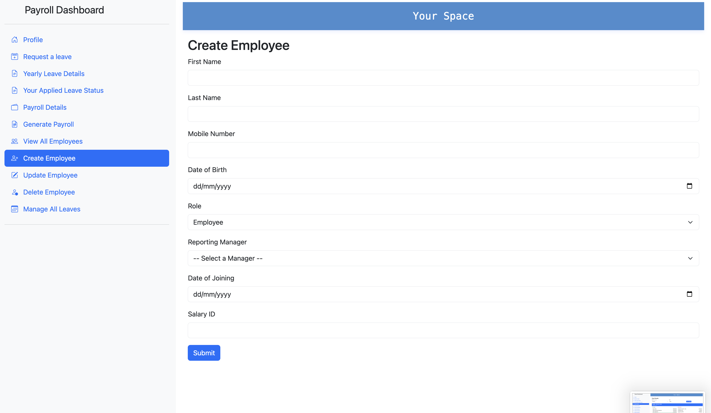
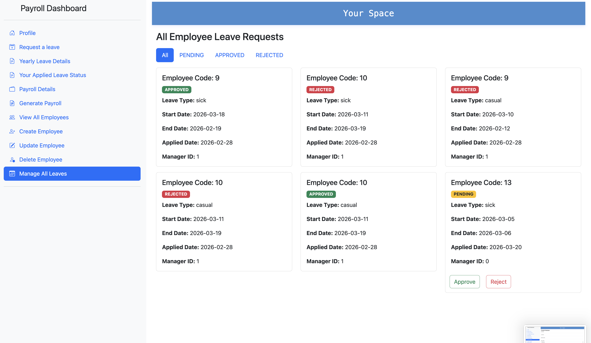
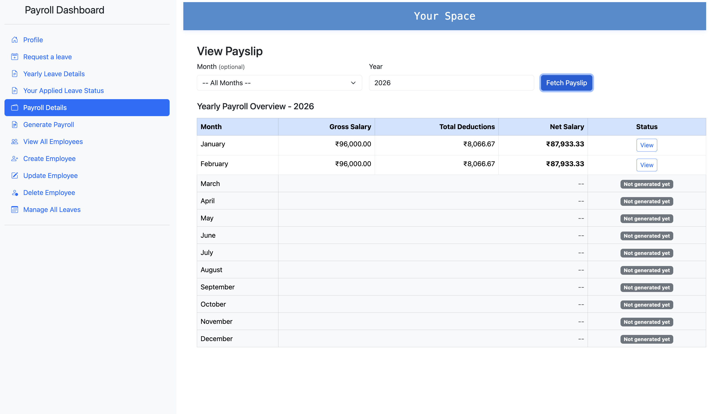

# Payroll Management System

A microservices-based payroll management system built with **Java 17, Spring Boot 3.3.1, and Spring Cloud**. Handles employee management, leave tracking with manager approval workflows, and salary processing using payroll rules.

## Architecture

Six independently deployable Spring Boot services orchestrated via Docker Compose:

| Service | Port | Purpose |
|---|---|---|
| Config Server | 8071 | Centralized Git-backed configuration |
| Eureka Server | 8070 | Service discovery & registration |
| Gateway Server | 8072 | API gateway, routing & Swagger aggregation |
| Employee | 8090 | Employee CRUD + Keycloak user provisioning |
| Leave | 8082 | Leave requests, approval workflow & balance tracking |
| Payroll | 8080 | Monthly salary calculation & payslip generation |

**Startup order:** Config Server -> Eureka -> Gateway / Business Services

## Tech Stack

Java 17 | Spring Boot 3.3.1 | Spring Cloud 2023.0.2 | PostgreSQL 16 | Keycloak | Spring Cloud Gateway | Eureka | OpenFeign | Docker (Jib) 

## Features

- **Employee Management** -- Create, update, delete employees with role-based access (Admin / Manager / Employee). Auto-provisions Keycloak users on creation.
- **Leave Management** -- Apply for sick, casual, and earned leave. Manager approval/rejection workflow. Yearly balance tracking (7 sick, 12 casual, 21 earned days).
- **Payroll Processing** -- Generate monthly payslips with earnings breakdown (Basic, HRA, Allowances) and deductions (PF, Professional Tax, Income Tax TDS). View yearly payroll overview.
- **Role-Based Dashboard** -- Sidebar navigation with profile, leave requests, payroll details, employee management, and leave approval views.

## Screenshots

| Profile | Leave Request | Payslip |
|---|---|---|
|  |  |  |

| Employee List | Generate Payroll | Leave Management |
|---|---|---|
|  |  |  |

| Create Employee | Leave Status | Yearly Overview |
|---|---|---|
|  |  |  |

## Quick Start

```bash
# Build all images and start via Docker Compose
./build-and-run.sh

# Or rebuild a specific service
cd payroll && ./mvnw compile jib:dockerBuild && cd ..
docker compose -f docker-compose/docker-compose.yml up -d --force-recreate payroll
```

## Access the Docker Images from my dockerhub account

All images are published to Docker Hub under `shaileshrathod28/`:

```
shaileshrathod28/configserver
shaileshrathod28/eurekaserver
shaileshrathod28/gatewayserver
shaileshrathod28/employee
shaileshrathod28/leave
shaileshrathod28/payroll
```

## Deployment Note

This project runs **6 microservices + PostgreSQL + Keycloak** (8 containers total). Due to the high resource requirements of running this many services simultaneously, I was unable to deploy this on any free tier platform available 
Explored platforms like AWS Free Tier, Render, Railway.
The project is designed to run locally via Docker Compose or one can deploy it on paid cloud environment 

